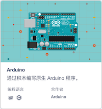

## Open

- **My Works**: Fully open source; everyone is welcome to participate in development.
- **New Project**: Built on brand-new technologies, making it more lightweight and efficient.
- **Featured Projects**: Integrates a variety of graphical programming tools, making it easier for you to start a new project.

## Create new project

From "New Project", select a hardware (or function) and click to enter the programming (or function) interface. The programming interface may vary slightly for different hardware. We'll use the Arduino hardware as an example to introduce the layout of the programming interface.

First, click the "Arduino" hardware icon to enter the Arduino programming interface:

- **Menu Bar**: Project editing and function menus.
  - **File Menu**: Create new and save projects.
  - **Edit Menu**: Undo, redo, and other editing operations.
  - **View Menu**: Switch between different information windows.
  - **Device Menu**: Connect and manage connected hardware devices.
  - **Project Name**: Display and edit the current project name.
  - **Download Button**: Download the program to the device.
- **Mode Tabs**: Switch between different editing modes.
  - **Blocks**: Graphical programming interface.
  - **Code**: Text-based programming interface.
  - **Serial**: View and debug serial output.
- **Blocks Area**: List of available blocks for programming.
  - **Block Categories**: Category tabs grouped by block type.
  - **Extensions**: List of extended blocks.
- **Programming Area**: The block programming workspace; drag blocks from the Blocks Area into this area to program.
  - **Toolbar**: Control tools for the programming area: view code, zoom in, zoom out, reset to original size.
- **Code Preview**: Real-time preview of the code generated from the block program.
- **Information Window**: Log and serial information window.
  - **Log**: Log message records.
  - **Serial**: Serial debugging display.

### Write first program

In the programming interface, you can write programs by dragging blocks into the programming area. By default, the programming area includes a **"when Arduino Uno setup"** block. This is a basic event block indicating the program that runs immediately after the Arduino is powered on. All other program blocks must be attached after this block.

1. Drag a **"Control"** category block, **"forever"**, into the programming area and attach it after the **"when Arduino Uno setup"** block.
2. Drag two **"wait (1000) ms"** blocks and attach them inside the **"forever"** block.
3. From the **"Pin"** category, drag two **"set pin [0] to (high)"** blocks and place them before each of the two **"wait (1000) ms"** blocks respectively.
4. Finally, change the pin parameter of both **"set pin [0] to (high)"** blocks to **"13"**, and change the other parameter to **"high"** for one and **"low"** for the other.

## Download to Arudino Uno

Connect your Arduino Uno board to the computer's USB port (install the driver first if needed, and ensure the serial connection is working properly).

1. In the "Arduino Uno" device menu, find the "Connect via USB…" option. Click it, select your board in the dialog, and then click the "Connect" button. 
    
   _(If your board does not appear in the dialog, check the connection or reinstall the driver.)_
2. Click the "Download" button on the menu bar. The program will be compiled and downloaded to the board. 
    
   _(If the download fails, check the "Log" window for the reason: if compilation fails, there is an error in the program; if the connection is lost, check the board connection.)_

## Run

After the download is complete, the device will restart and the program will run automatically. The effect of this program is that the LED on the board will blink alternately.
